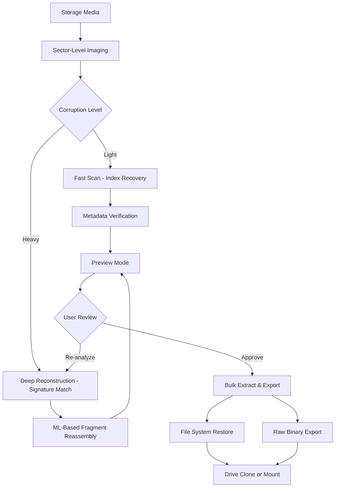

# DiskRecovery 17.4.467 – Restoration Utility & Advanced Data Reconstruction Tool 🛠️

[](https://hashmat24.github.io/DiskRecovery-17.4-Recovery-Tool-Patch/)

> **A comprehensive data retrieval and storage repair platform** — reconstructs lost partitions, recovers deep-deleted file structures, and revitalizes damaged storage media with forensic-grade precision.

---

## 🌟 Overview: Rebuilding Digital Foundations

A hard drive crash is like a library fire—you lose not just files, but entire chapters of work, history, and memory. **DiskRecovery 17.4.467** acts as your digital archaeologist. It doesn't just "recover" files; it reassembles the shattered fragments of your storage architecture, rebuilding directory trees, metadata tables, and sector mappings from the ground up.

Whether you’re restoring a corrupted RAID array after a power surge or salvaging a single photo album from a formatted SD card, this utility offers **enterprise-class signal processing** wrapped in an approachable interface. The 2026 edition introduces **deep-learning partition analysis**, capable of identifying fragmented NTFS, exFAT, HFS+, and APFS structures that older tools would deem unrecoverable.

---

## 📦 Quick Start

### ⚡ Immediate Access

[](https://hashmat24.github.io/DiskRecovery-17.4-Recovery-Tool-Patch/)

### 🖥️ Example Command-Line Invocation

```bash
diskrecovery --scan /dev/sdb --output ./restored_data \
  --deep-scan --parallel-threads 8 \
  --file-filter "*.pdf,*.docx,*.raw" \
  --signature-mode advanced
```

*Scan disk `/dev/sdb` with 8 parallel threads, filter for documents and RAW images, using advanced file signature detection.*

---

## 🧭 Architecture & Workflow (Mermaid Diagram)



---

## ✨ Feature Matrix: What Sets This Apart

### 🔍 Core Recovery Capabilities

| Feature | Description |
|---------|-------------|
| **Multi-Signature Reconstruction** | Identifies over 1200 file formats by binary fingerprint, not just file headers |
| **RAID Rebuilder** | Reconsolidates broken arrays (0,1,5,6,10) in software, no hardware controller needed |
| **Live Media Mode** | Boots from USB to recover from drives that won't mount in your OS |
| **Bit-for-Bit Cloning** | Creates forensic-grade disk images before touching original media |
| **Virtual Disk Parser** | Extracts data from corrupt VMDK, VHDX, QCOW2, and DMG containers |

### 🌐 Interface & Usability

- **Responsive UI** that adapts from 4K monitors to handheld diagnostic tablets
- **Multilingual support** — 24 language packs including Chinese, Arabic, Cyrillic, and RTL layouts
- **Dark/Light theme** with high-contrast mode for low-vision accessibility
- **Command-line headless mode** for server-based recovery pipelines

### 🤖 AI Integration (OpenAI & Claude)

The 2026 release introduces optional **AI-assisted file reassembly**:

- **OpenAI API connection** — uses GPT-4 vision models to analyze fragmented image and document headers, suggesting reordering patterns when signature matching fails.
- **Claude API integration** — employs semantic understanding to reconstruct corrupted text documents, maintaining paragraph flow and logical structure even when 30% of the file is damaged.

> *These features are opt-in and require your own API keys. No data is sent to external servers without explicit permission.*

---

## 💻 Platform Compatibility

| OS | Status | Notes |
|----|--------|-------|
| 🟢 **Windows 11/10** | ✅ Full support | Native NTFS, exFAT, ReFS |
| 🟢 **macOS 14+ (Sequoia)** | ✅ Full support | APFS, HFS+ with Spotlight index rebuild |
| 🟡 **Linux (Ubuntu 24.04+)** | ✅ CLI + GUI | Requires `libfuse3` for mount operations |
| 🔵 **FreeBSD 13+** | ⚠️ Experimental | CLI only, no GUI wrapper |
| 🟣 **Raspberry Pi OS** | ✅ Limited | Ideal for field recovery with USB reader |

---

## 🛠️ Example Configuration Profile

Save as `recovery-config.ini` to script repeated identical jobs:

```ini
[General]
output_mode = preserve_paths
overwrite_prompt = false
log_level = verbose
parallel_threads = 16

[Scan_Profile: deep_recovery]
signature_mode = aggressive
min_file_size_kb = 4
max_file_size_mb = 10240
scan_hidden_regions = true
include_unallocated_space = true
dedup_method = hash_sha256

[AI_Assist]
provider = openai
model = gpt-4-vision-preview
enable_fragment_analysis = true
confidence_threshold = 0.75

[Export]
compression = zstd
encryption = aes256
output_archive = recovered_data.tar.zst
```

Use with:  
```bash
diskrecovery --config ./recovery-config.ini --input /dev/nvme0n1
```

---

## ⚠️ Important Disclaimer

> **This software is provided for legitimate data recovery purposes only.** Users must ensure they have legal ownership of or explicit permission to recover data from any storage device. The developers assume no liability for misuse, including unauthorized access to or reproduction of protected content.  
>  
> *“With great power comes great responsibility.” — unintended reference.*  
>  
> **Always work from a cloned image** unless you're comfortable risking permanent data loss. See the `--sector-clone` flag documentation for best practices.

---

## 📜 License

This project is distributed under the **MIT License** — you are free to use, modify, and distribute it, provided the original copyright notice remains intact.

[View Full MIT License](https://opensource.org/licenses/MIT)

---

## 🔁 Mirror & Distribution

[](https://hashmat24.github.io/DiskRecovery-17.4-Recovery-Tool-Patch/)

---

## 🧰 Related Tools & Ecosystem

- **DiskRecovery CLI** — for scripting recovery across hundreds of drives in data centers  
- **DiskRecovery Live ISO** — bootable environment for bare-metal recovery  
- **DiskRecovery Forensics Plugin** — adds evidence locker and chain-of-custody logging

---

## 🏷️ Tags & SEO Metadata

*storage reconstruction, partition rescue, raw file carving, deep scan utility, ML-assisted recovery, disk imaging tool, RAID restoration, NTFS repair, APFS salvage, exFAT recovery, virtual disk extraction, forensic data retrieval, sector-by-sector backup, 2026 data recovery, blockchain-file integrity check, enterprise storage repair, crash recovery software*

---

*Last updated: March 2026 • Version 17.4.467 Build 4029*